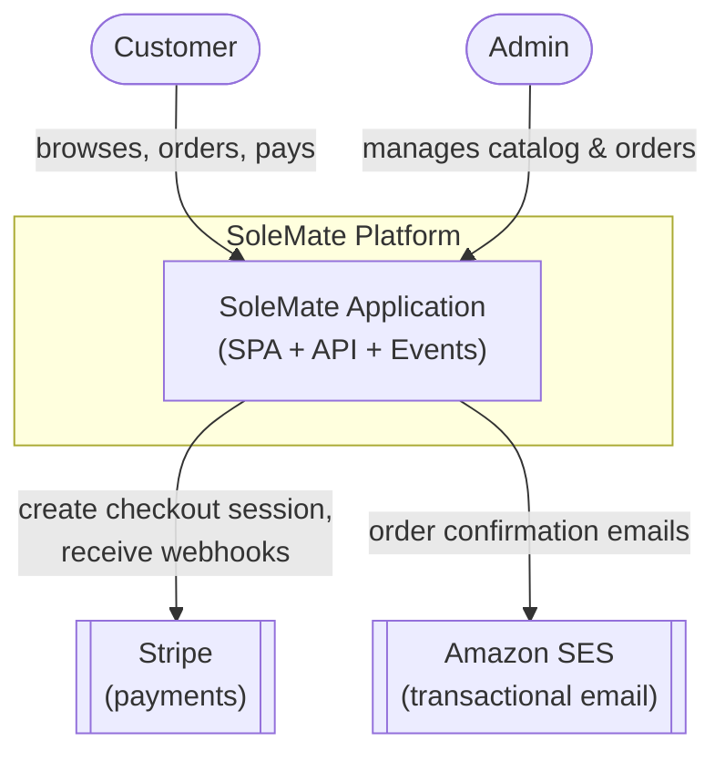
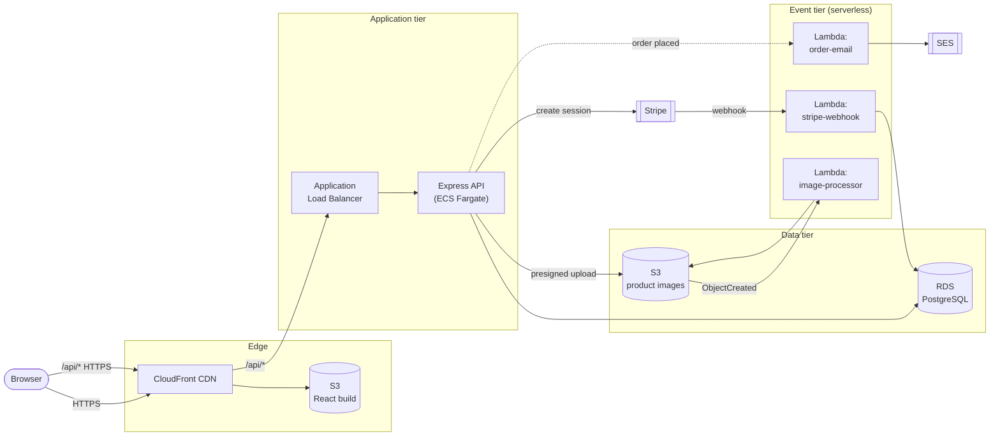
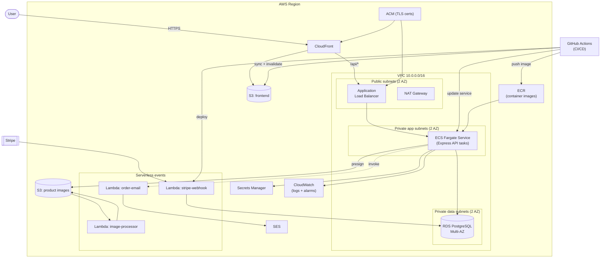
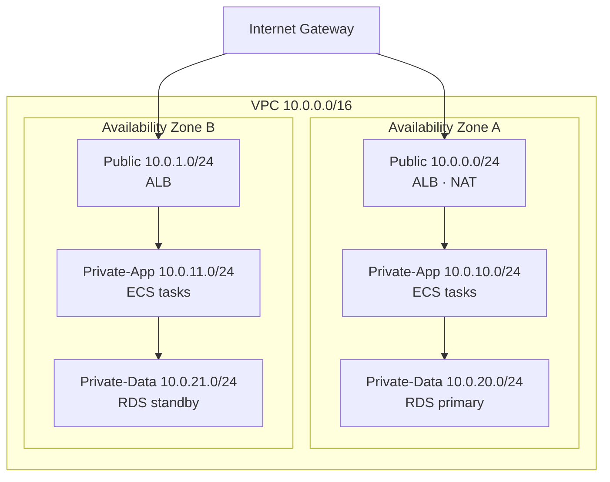
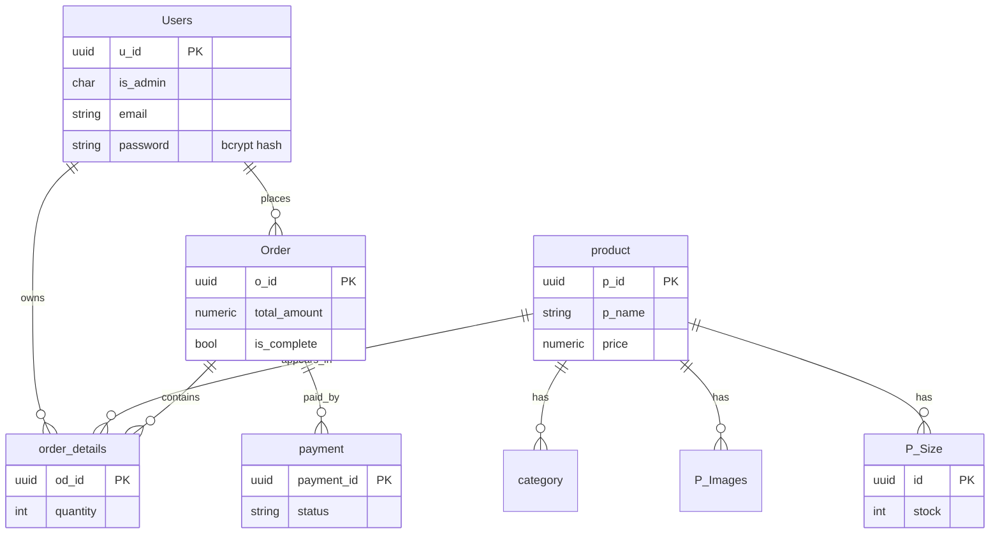
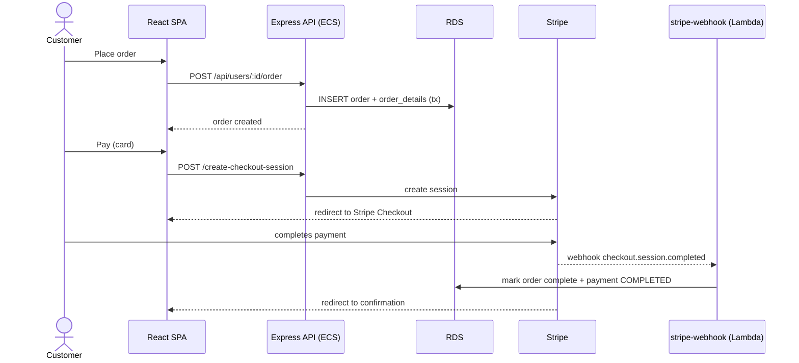
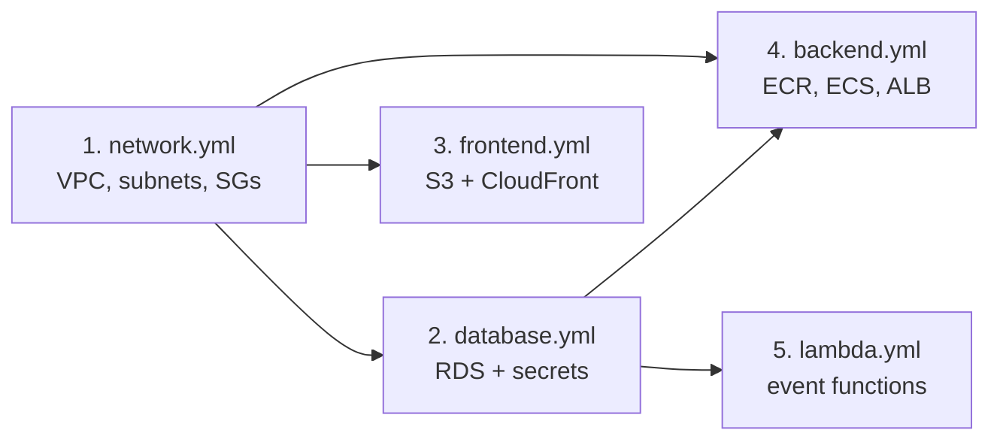
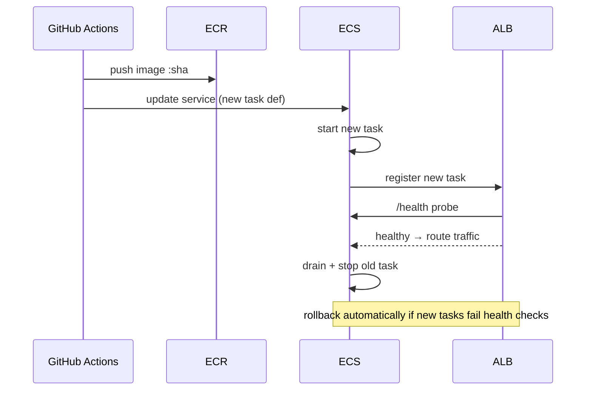
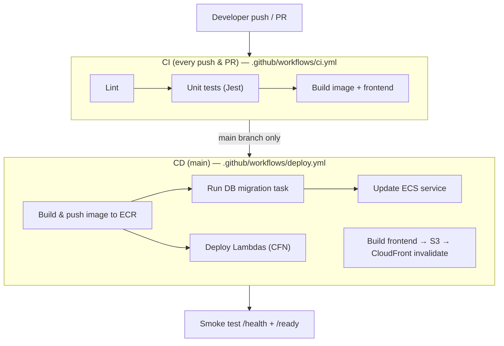

# SoleMate — Architecture & Deployment Design

**Project:** SoleMate (footwear ecommerce platform)
**Document type:** Architecture & DevOps design
**Group members:** M Shazam Khan (22K4207) · Hasnain Raza (22K4284)
**Cloud target:** Amazon Web Services (ECS Fargate + Lambda)
**IaC:** AWS CloudFormation (YAML) · **CI/CD:** GitHub Actions

---

## 1. Introduction

### 1.1 Purpose
This document describes the architecture of the SoleMate ecommerce application
and the design for deploying it to AWS using modern DevOps practices:
Infrastructure as Code, containerization, a serverless event tier, and a fully
automated CI/CD pipeline.

### 1.2 Scope
It covers the application architecture (frontend, API, data, events), the target
AWS cloud architecture, the network/security design, the deployment process, and
the CI/CD pipeline. Diagrams are provided at the system, container, deployment,
and network levels.

### 1.3 Goals & non-functional requirements

| Goal | How it is addressed |
|------|--------------------|
| **Scalability** | Stateless API on ECS Fargate behind an ALB with auto-scaling; serverless Lambda for spiky event work |
| **Availability** | Multi-AZ deployment of ECS tasks and RDS; managed, self-healing services |
| **Security** | Private subnets for compute/data, secrets in Secrets Manager, least-privilege IAM, HTTPS everywhere |
| **Maintainability** | 100% IaC, immutable container images, one-command pipeline deploys |
| **Observability** | Centralized logs (CloudWatch), health/readiness probes, metrics & alarms |
| **Cost-efficiency** | Fargate right-sizing, serverless for bursty work, S3+CloudFront for static assets |

---

## 2. Application overview

SoleMate is a classic three-tier web application.

| Tier | Technology | Responsibility |
|------|-----------|----------------|
| Presentation | React 18 + Vite + Tailwind (SPA) | UI, cart, checkout, admin |
| Application | Node.js + Express REST API | Auth (JWT), products, orders, payments |
| Data | PostgreSQL | Users, products, orders, payments |
| Events | (new) AWS Lambda | Stripe webhook, image processing, email |
| Storage | Object storage (S3) | Product images |
| External | Stripe | Card payments |

---

## 3. System context (C4 — Level 1)



**Actors**

- **Customer** — browses products, manages a cart, places and pays for orders.
- **Admin** — manages the product catalog, sizes, images, and views orders.

**External systems**

- **Stripe** — hosted card checkout + webhooks for payment confirmation.
- **Amazon SES** — sends order-confirmation email (replaces the old EmailJS).

---

## 4. Container architecture (C4 — Level 2)



**Why this split (ECS for the API, Lambda for events)?**

- The Express API is a long-running request/response service with steady traffic
  and shared connections (a DB pool). That fits a **container on ECS Fargate**.
- The webhook, image-processing, and email tasks are **event-driven and bursty**.
  They map naturally to **Lambda**, which scales to zero and bills per invocation.

This is a deliberate architectural decision, not "Lambda for everything."

---

## 5. AWS deployment architecture



### 5.1 AWS service inventory

| Service | Role in SoleMate |
|---------|------------------|
| **CloudFront** | CDN for the SPA + TLS termination; routes `/api/*` to the ALB |
| **S3 (frontend)** | Hosts the static React build (private, served via CloudFront OAC) |
| **S3 (images)** | Stores product images; emits events to the image-processor Lambda |
| **ALB** | Load-balances and health-checks the ECS API tasks |
| **ECS Fargate** | Runs the Express API as containers (no servers to manage) |
| **ECR** | Stores versioned API container images |
| **RDS (PostgreSQL)** | Managed, Multi-AZ relational database |
| **Lambda** | Stripe webhook, image processing, order emails |
| **Secrets Manager** | DB credentials, JWT secret, Stripe keys |
| **ACM** | TLS certificates for CloudFront and the ALB |
| **CloudWatch** | Logs, metrics, dashboards, alarms |
| **SES** | Transactional email |
| **IAM** | Least-privilege roles for ECS tasks, Lambdas, and CI/CD |

---

## 6. Network & security design



### 6.1 Subnet tiers
- **Public subnets** — only internet-facing resources (ALB, NAT Gateway).
- **Private app subnets** — ECS tasks; outbound internet via NAT only.
- **Private data subnets** — RDS; no internet route at all.

### 6.2 Security groups (least privilege)

| SG | Inbound | From |
|----|---------|------|
| `alb-sg` | 443, 80 | `0.0.0.0/0` |
| `ecs-sg` | container port (5000) | `alb-sg` only |
| `rds-sg` | 5432 | `ecs-sg` and the migration runner only |

### 6.3 Secrets & identity
- No secrets in images or env files — all pulled from **Secrets Manager** at task
  start and injected into the container.
- **IAM roles** are scoped per workload (ECS task role, each Lambda's execution
  role, the CI/CD deploy role) — no shared, broad credentials.
- TLS end-to-end (CloudFront → ALB → task), HSTS via `helmet`.

---

## 7. Data model



Full DDL: [`backend/DB/schema.sql`](../backend/DB/schema.sql). The same schema is
applied to local Postgres (dev) and RDS (prod) via `npm run db:migrate`.

---

## 8. Key runtime flow — checkout



*(Non-card methods — Cash on Delivery / Bank Transfer — skip Stripe and record
the payment directly via the API.)*

---

## 9. Deployment process

### 9.1 Environments

| Environment | Frontend | API | Database |
|-------------|----------|-----|----------|
| **Local** | Vite dev server | `npm run dev` | Docker Postgres |
| **Staging** | S3 + CloudFront | ECS service (1 task) | RDS (single-AZ) |
| **Production** | S3 + CloudFront | ECS service (≥2 tasks, auto-scale) | RDS Multi-AZ |

### 9.2 Provisioning order (CloudFormation stacks)
Stacks are deliberately split so they can be updated independently:



### 9.3 Rolling (zero-downtime) API deploy
ECS performs a rolling replacement; the ALB only sends traffic to tasks that
pass the `/health` check, and drains old tasks gracefully (the API handles
`SIGTERM`).



### 9.4 Database migrations
Migrations run as a one-off **ECS task** (same image, `npm run db:migrate`)
before the service update, so schema changes land before new code serves traffic.

---

## 10. CI/CD pipeline



### 10.1 Pipeline stages

| Stage | Trigger | Action |
|-------|---------|--------|
| **Lint & test** | every push/PR | ESLint + Jest; blocks merge on failure |
| **Build** | every push/PR | Build Docker image and frontend bundle |
| **Push image** | merge to `main` | Tag with git SHA, push to ECR |
| **Migrate** | merge to `main` | Run migration as a one-off ECS task |
| **Deploy API** | merge to `main` | Update ECS service (rolling) |
| **Deploy Lambdas** | merge to `main` | `aws cloudformation deploy` for `lambda.yml` |
| **Deploy frontend** | merge to `main` | `aws s3 sync` + CloudFront invalidation |
| **Verify** | after deploy | curl `/health` and `/ready` |

### 10.2 Pipeline security
- AWS access uses **GitHub OIDC** (short-lived role assumption) — no long-lived
  AWS keys stored in GitHub.
- Image is tagged immutably with the commit SHA for traceability and rollback.

---

## 11. Observability & operations

- **Logs:** the API logs structured JSON (`pino`) to stdout → CloudWatch Logs.
- **Health:** `GET /health` (liveness) and `GET /ready` (DB reachable) back the
  ALB target-group and container health checks.
- **Metrics & alarms:** ALB 5xx rate, ECS CPU/memory, RDS connections/CPU →
  CloudWatch alarms.
- **Scaling:** ECS target-tracking on CPU (e.g. scale out at 70%).
- **Backups:** RDS automated snapshots + point-in-time recovery.

---

## 12. Cost considerations (illustrative)

| Service | Driver | Lever |
|---------|--------|-------|
| ECS Fargate | task count × size × time | right-size CPU/mem, scale to 1 task off-peak |
| RDS | instance class + Multi-AZ | single-AZ in staging, smallest viable class |
| NAT Gateway | hourly + data | one NAT (vs per-AZ) in non-prod |
| S3 + CloudFront | storage + egress | cache static assets aggressively |
| Lambda | invocations + duration | scales to zero when idle |

---

## 13. Repository layout (DevOps artifacts)

```
.
├── docs/DESIGN.md                  ← this document
├── .github/workflows/
│   ├── ci.yml                      ← lint, test, build (every push/PR)
│   └── deploy.yml                  ← deploy to AWS (main)
├── infra/cloudformation/
│   ├── network.yml                 ← VPC, subnets, NAT, security groups
│   ├── database.yml                ← RDS PostgreSQL + Secrets Manager
│   ├── backend.yml                 ← ECR, ECS cluster/service, ALB, IAM
│   ├── frontend.yml                ← S3 + CloudFront for the SPA
│   └── lambda.yml                  ← event-driven Lambda functions
├── infra/lambdas/                  ← Lambda source
├── backend/Dockerfile              ← API container image
└── docker-compose.yml             ← local Postgres + API
```

---

## 14. Summary

SoleMate is deployed as a **containerized API on ECS Fargate** behind an ALB,
with a **serverless event tier on Lambda**, a managed **RDS PostgreSQL** database,
and the **React SPA served from S3 via CloudFront** — all defined in
**CloudFormation** and shipped through an automated **GitHub Actions** pipeline.
The design prioritizes scalability, security (private subnets, managed secrets,
least-privilege IAM), zero-downtime deploys, and full observability, while keeping
cost in check through right-sizing and serverless-for-bursty-work.
